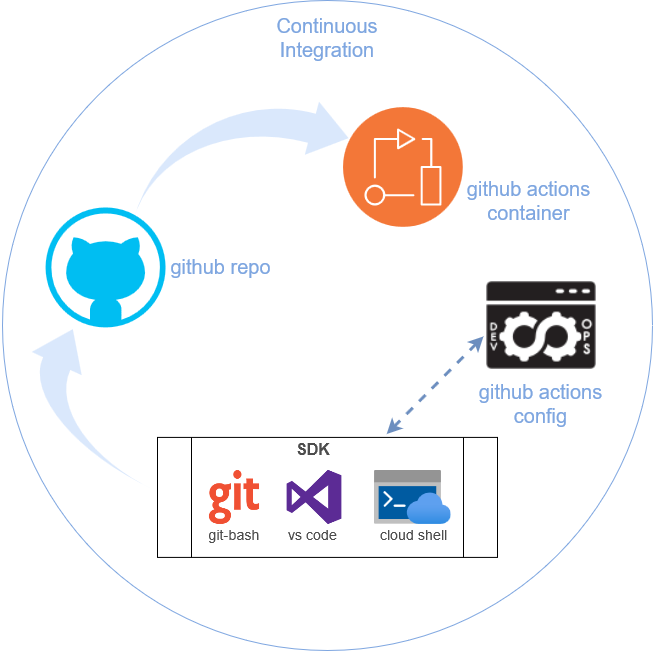
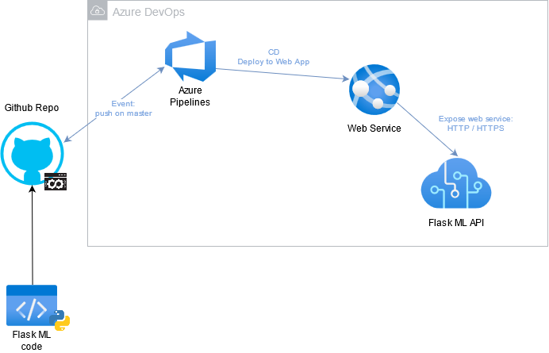
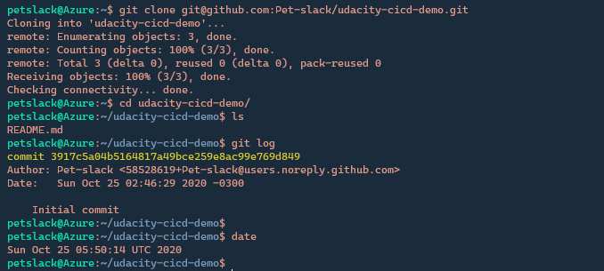
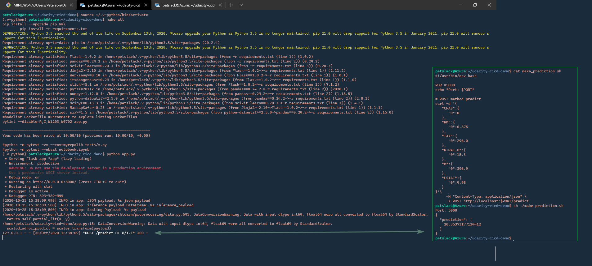
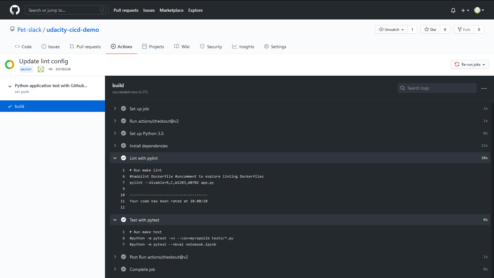
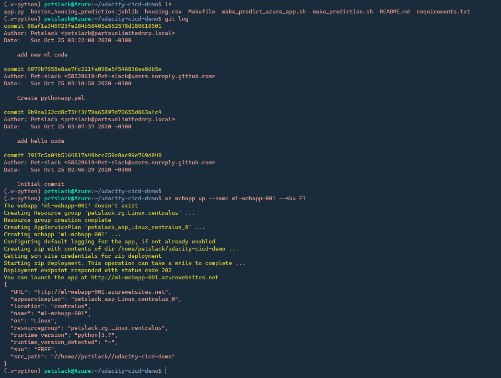
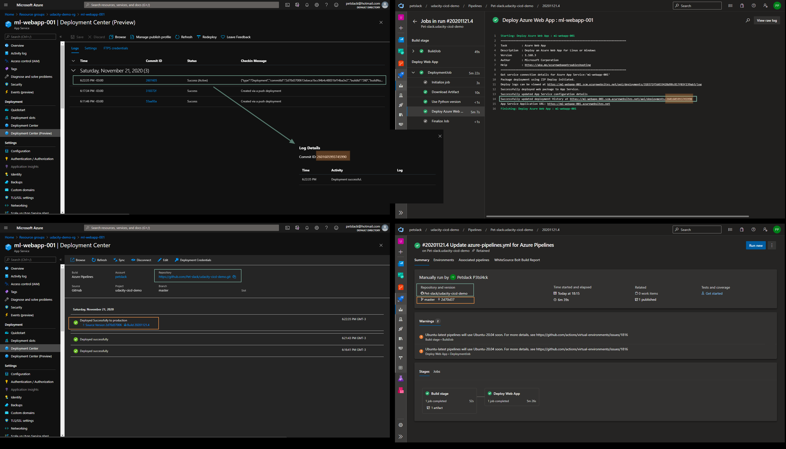
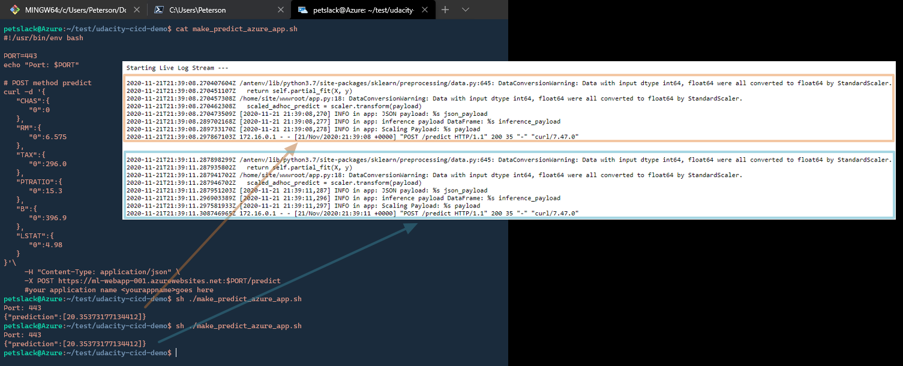
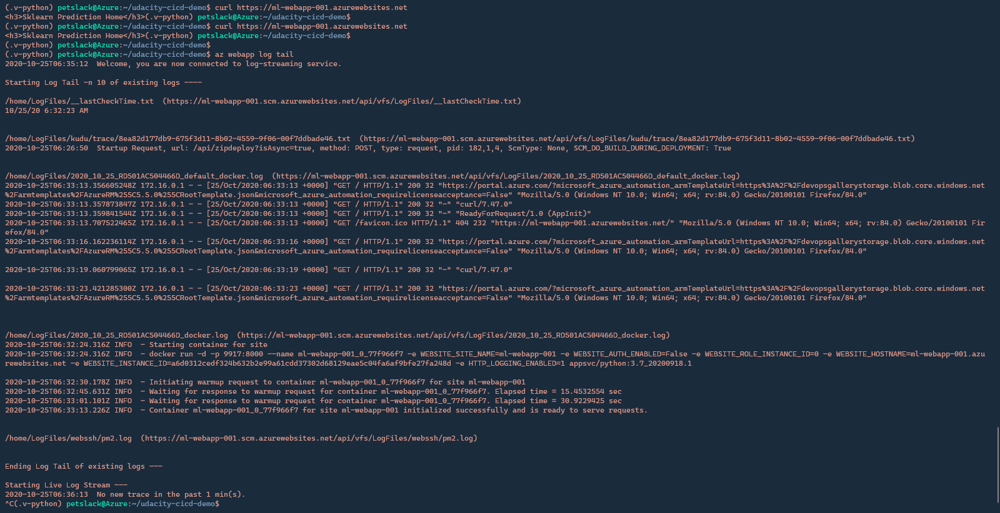
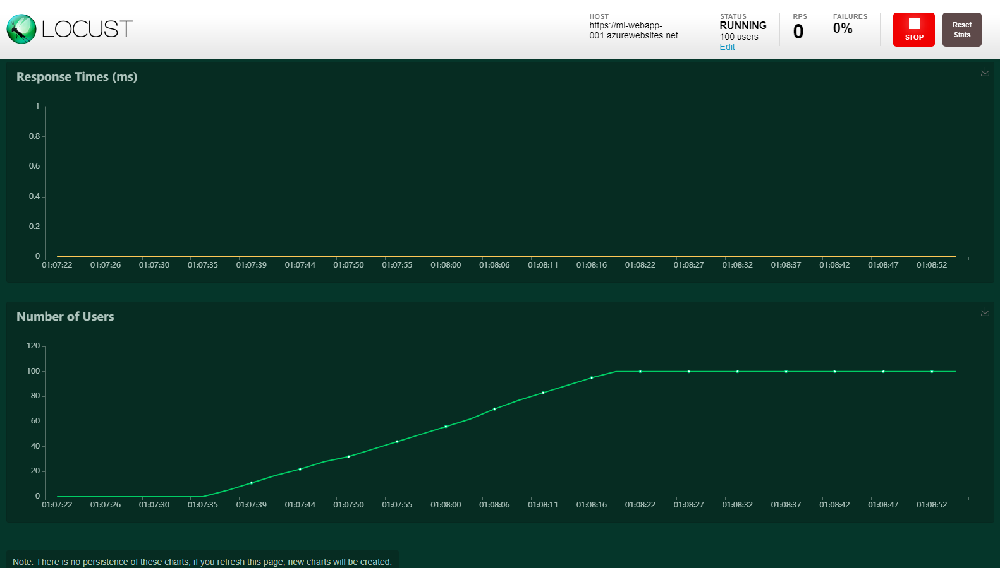

# Overview

**Machine Learning Predict at Cloud. This project uses MS Azure PaaS and it´s a DevOps compliance project.**

## Project Plan
This project is designed to be deployed at [MS Azure App Services](https://azure.microsoft.com/en-us/services/app-service/), using DevOps CI/CD pipelines

* A link to a Trello board for the project [ML WebApp Project Board](https://trello.com/b/cdOSQmny/ml-webapp)
* A link to Project Plan spreadsheet: [ML WebApp Project Plan](https://docs.google.com/spreadsheets/d/1n43xnL9KeBi6VD-NJldy7YswKPCqkVuneJCUcn6Bw_Q)

## Getting Started

1. Clone this repository
2. Create your infrastructure as code
3. Update this **azure_pipelines.yml** to reflect your Azure environment.

## Dependencies
1. Create an [Azure Account](https://portal.azure.com) 
2. Install the [Azure command line interface](https://docs.microsoft.com/en-us/cli/azure/install-azure-cli?view=azure-cli-latest)
3. Create an [Azure DevOps account](https://dev.azure.com)
4. Install [Azure Cloud Shell](https://docs.microsoft.com/en-us/azure/cloud-shell/using-the-shell-window)

## Instructions

* Architectural Diagram
  * 
  * 

### Azure CLI or Azure Cloud Shell
**PRE-REQ: Make sure you are logged at your Azure via *Azure CLI* command:** <pre>az login</pre>
1. Clone this Github repository locally:
```
git clone https://github.com/Pet-slack/udacity-cicd-demo.git
cd udacity-cicd-demo
```
2. Create your Python virtual environment
- Create  a **Python3.x** virtualenv
```
python3 -m venv ~/.v-python
```


- Activate your virtualenv
```
source ~/.v-python/bin/activate
```
3. Run your project locally
- Set it up:
```
make all
```
- Run the program:
```
python app.py
```
- Test the program running a *ML prediction*:
```
sh ./make_prediction.sh
```


### Github Actions
- Check *Github Actions CI* status



### Deploy to Azure
<div class="col d-flex justify-content-center" style="padding-top: 10px;">

</div>

1. Initial project App Service setup/deploy:
```
az webapp up --name <APP_NAME> --sku F1 --location <LOCATION> --resource-group <RESOURCE_GROUP>
```


2. Setup and deploy CI/CD
- Log in at **Azure DevOps** and setup a new project using this Github Repo as source
- Set up a Service Connection for your project called **myUdacitySP_Conn**
- Deploy the *DevOps project* to *Azure App Service* running the CI/CD pipeline
<p class="lead">✔️ &nbsp; Run Pipeline: Go to Project >> Pipelines >> Pipelines >> Click on <em>Pet-slack.udacity-cicd-demo</em> >> Click on <em>Run pipeline</em></p>

3. Check the CI/CD deployment



4. Test Azure App Service deployment:
```bash
udacity@Azure:~$ ./make_predict_azure_app.sh
Port: 443
{"prediction":[20.35373177134412]}
```


5. Output of streamed log files from deployed application
```bash
az webapp log tail --name <APP_NAME> --resource-group <RESOURCE_GROUP>
```



## Quick Deploy

Run the following commands to fully deploy this project at MS Azure.
```bash
https://raw.githubusercontent.com/Pet-slack/udacity-cicd-demo/master/scripts/full-deploy-commands.sh start
https://raw.githubusercontent.com/Pet-slack/udacity-cicd-demo/master/scripts/full-deploy-commands.sh deploy
```

## Load Testing

**Locust load testing output for Azure App Service**



## Enhancements

- Add multiple stages:
  - [x] Deploy CD DEV stage. *In progress at **ml-dev** branch*
  - [ ] Deploy CD Github Actions option. *Pending*

## Demo 

<TODO: Add link Screencast on YouTube>

